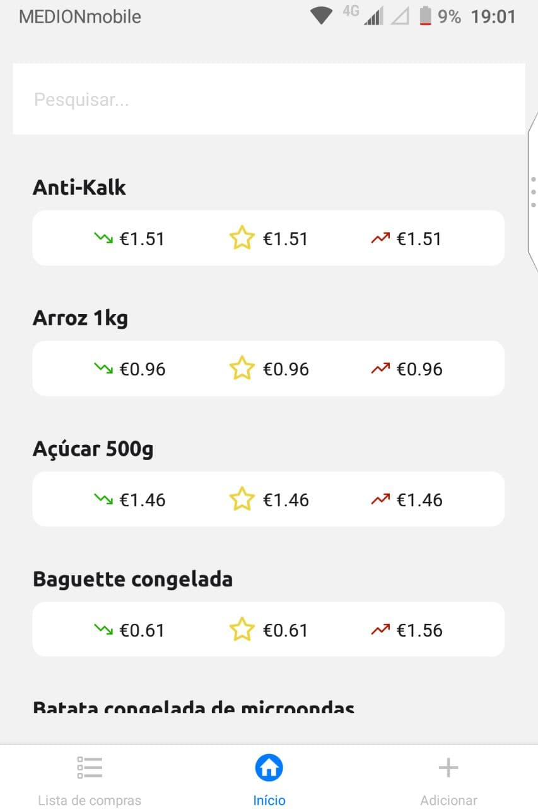

# Preços do mercadinho - Grocery prices compare app

  

This app displays a list of purchases to help you evaluates if some item is expensive or not. After you register a purchase, it calculates what price of this item you should expect next time you visit a market.

    

## 🚀 How to use

If you also want to use this app, follow these [instructions](instructions/README.md).

## 📝 Notes

- Icons made by <a href="https://www.flaticon.com/authors/freepik" title="Freepik">Freepik</a> from <a href="https://www.flaticon.com/" title="Flaticon">www.flaticon.com</a>
