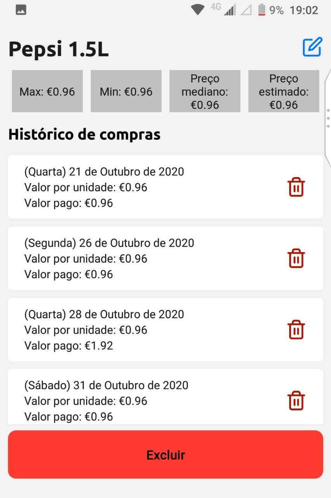

# Preços do mercadinho - Grocery prices compare app

  <!-- Android -->
  

This app displays a list of purchases to help you evaluates if some item is expensive or not. After you register a purchase, it calculates what price of this item you should expect from this item next time you visit a market.

   

## 🚀 How to use

If you also want to use this app, follow these [instructions](instructions/README.md).

## 🤔 Final thoughts

### Pros

Groceries' prices where I lived fluctuates very frequently, and it's not a easy task to track them or to check if some product has a real discount or not. Before, I was using Google sheets to register these prices, but soon enough the list grows exponentially and many times I'd lost history prices for a specific item.

This app is a very personal need that I have and I'm pretty sure there are other apps that can do the same thing. However, this was a good opportunity to me to practice Typescript, to discover by myself how to use React Native to create a nice interface, to study in a very superficial layer some statistics to estimate prices and use on a real application what I have studied in Algorithms course, since I create my own Max Heap data structure.

### Caveats

It's a very simple app with no sensitive data on it whatsoever, so everything should work locally. But, since me and my family will be using it, it must have some kind of data persistence for ours smartphones.

I've chosen Firebase to host its database. Although it's very simple database, it's make no sense to leave it public (*I don't want anyone to change my potato price*), so I've added a login page, also using Firebase authentication and Expo Google Sign in.

Adding firebase and a login added a complexity layer that I wasn't expecting for this simple app, and the simplest solution was to add a json file which is not committed for git. It's not recommend to store API keys in `json` files or `.env` files, but I've also didn't want another to add another complexity layer to this application to **just** keep track of my groceries prices. 

Besides this issue, this project is missing tests, which I confess I found very difficult to know what parts of my code I should test, specially test React: I personally think testing Node/Java more intuitive than testing React or Vue.

### Veredict

I loved this project, not only because it was a problem that I had that I personally believes solved it completely, but also highlighted some of my weakness that I should work harder for the next projects.

## 📝 Notes

- Icons made by <a href="https://www.flaticon.com/authors/freepik" title="Freepik">Freepik</a> from <a href="https://www.flaticon.com/" title="Flaticon">www.flaticon.com</a>
