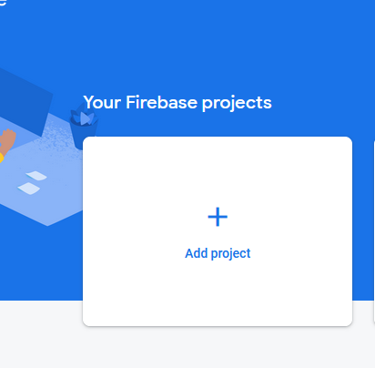
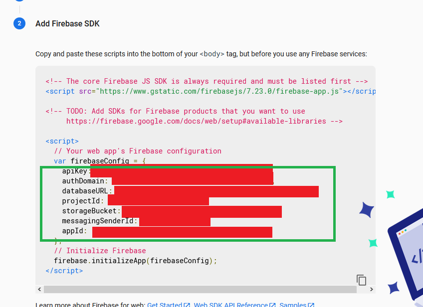
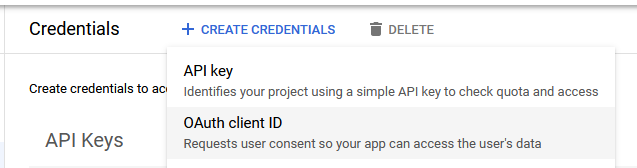
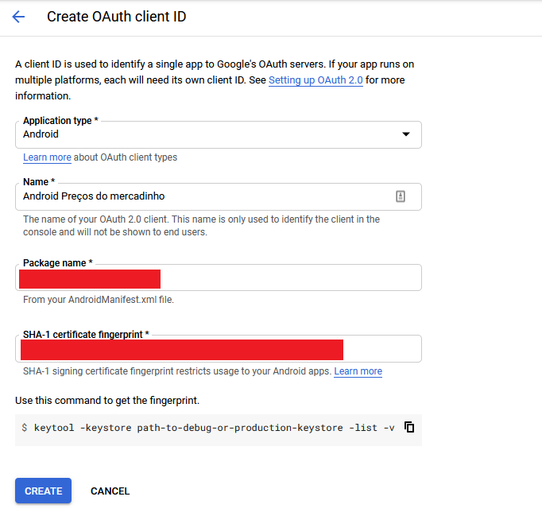
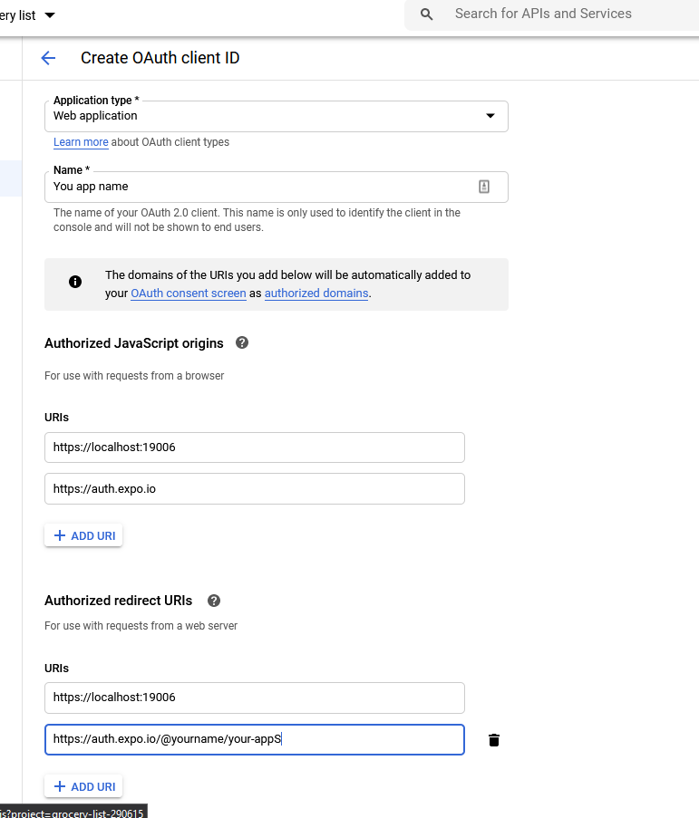
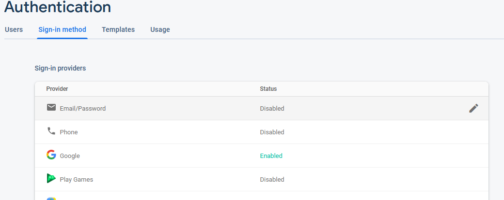
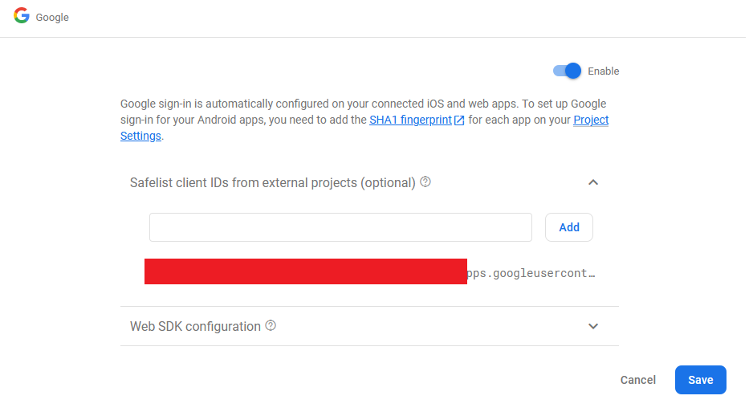
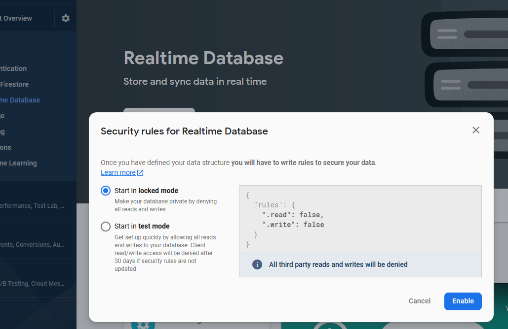

# ⚠️ Before you start
* This app requires that you have a Google account to use it;
* A know caveat of this project is the lack of testing and lack of security layer to store API keys. **DON'T** commit your API keys to your repository.
* Have a extra care with these following files:
  * `src/config/keys.json`: create this file just copying the `src/config/TEMPLATE.keys.json` content.
  * `app.json`: Change *expo.android.package* value **BEFORE** creating a new apk. This package name will be use in both Firebase Console and Google Credentials.

## Create a new Firebase Project

1. Create a new project from [Firebase Console](https://console.firebase.google.com/).



2. To get yours fingerprints, type `expo fetch:android:hashes` on your console. This should look like this:

```
$ expo fetch:android:hashes
Accessing credentials for USER in project precos-do-mercadinho
Google Certificate Fingerprint:     GOOGLE API & SERVICES FINGERPRINTS
Google Certificate Hash (SHA-1):    XXX
Google Certificate Hash (SHA-256):  XXX
Facebook Key Hash:                  XXX
```

>❗ If this commands returns that it cannot get its hashes, generate an aux build with `expo build:android -t apk` then try to generate the fingerprints again.


## Firebase Web App keys

1. Visit [Firebase Console](https://console.firebase.google.com/).

2.  Select the Firebase Web app, follow the instructions and copy the API keys values.



3. Paste these values to `src/config/keys.json`. This file should now look like this:
```json
{
  "apiKey": "FIREBASE KEY",
  "authDomain": "FIREBASE KEY",
  "databaseURL": "FIREBASE KEY",
  "projectId": "FIREBASE KEY",
  "storageBucket": "FIREBASE KEY",
  "messagingSenderId": "FIREBASE KEY",
  "appId": "FIREBASE KEY",
  "measurementId": "FIREBASE KEY",
  "webClientId": "",
  "androidStandaloneAppClientId": "",
}
```

## Google Credentials keys

1. Visit [Google API & Services](https://console.developers.google.com), access the **Credentials** menu and create an OAuth Client ID.



2. Get the **package name** from `app.json` and the *GOOGLE API & SERVICES FINGERPRINTS* from the previous step and fill the form that will show up.



3. Insert the name of the app (*eg: Preços do mercadinho*), and autorize the following urls:

**Authorized Javascript origins**

  1. https://localhost:19006
  2. https://auth.expo.io

**Authorized redirect origins**

  1. https://localhost:19006
  2. https://auth.expo.io/@yourname/your-appS (*eg: https://auth.expo.io/@sinayra/precos-do-mercadinho , usually the slug from app.json*)



4. After that, copy tour Client ID for each OAuth you created.

5. Paste this id into your `config/src/keys.json`. Now this file should be look like this:

```json
{
  "apiKey": "FIREBASE KEY",
  "authDomain": "FIREBASE KEY",
  "databaseURL": "FIREBASE KEY",
  "projectId": "FIREBASE KEY",
  "storageBucket": "FIREBASE KEY",
  "messagingSenderId": "FIREBASE KEY",
  "appId": "FIREBASE KEY",
  "measurementId": "FIREBASE KEY",
  "webClientId": "GOOGLE KEY FROM STEP 3",
  "androidStandaloneAppClientId": "GOOGLE KEY FROM STEP 2",
}
```

## Google Services file

1. Create a Android app from Firebase console, where the package name **must be** exactly what it is in your `app.json` file. There is no need to put fingerprints, so leave it blank. After that, download the `google-services.json` file. The final directory structure should be like this:
```
  .
  ├── ...                    
  ├── src
      ├── ...
      ├── config
          ├── keys.json
      ├── ...               
  ├── .gitignore                    
  ├── app.json              
  ├── App.tsx
  ├── babel.config.js
  ├── google-services.json
  ├── package.json
  ├── README.md
  └── tsconfig.json
```

## Firebase services

This project uses Firebase authentication and Realtime Database.


### Authentication

1. To enable authentication, navigate to **Sign-in method** menu and enable **Google**.



2. Add your Android Client ID (from Google Services) to the safelist.



### Database

1. Press **Create Database** button and create one in **locked mode**.



2. After created, navigate to **Rules** menu and specified who should read and write in your database. My suggestion is to enable some functionalities just for some users, in hard-coded mode (I think is easier, but this is one of the caveats of this projects).

```json
{
  "rules": {
      ".write": "auth.uid == 'UID1' || auth.uid === 'UID2'",
      ".read": "auth.uid == 'UID1' || auth.uid === 'UID2'"
  }
}
```
To get this UID, you can check the Firebase Authentication menu after the user has signed in.

## Generating the android app

You can generate a ``apk`` file with the following command at your console:
```sh
expo build:android -t apk
```
It will take a while to generate, but, once is finished, your console should show theses messages

```
$ expo build:android -t apk

Checking if there is a build in progress...

Accessing credentials for sinayra in project precos-do-mercadinho

- Expo SDK: 39.0.0
- Release channel: default
- Workflow: Managed

- Optimization: Project may contain uncompressed images. Optimizing image assets can improve app size and performance.
  To fix this, run npx expo-optimize. Learn more: https://docs.expo.io/distribution/optimizing-updates/#optimize-images

Building optimized bundles and generating sourcemaps...
Starting Metro Bundler.
Building iOS bundle
Building Android bundle
Finished building JavaScript bundle in 8333ms.
Building source maps
Finished building JavaScript bundle in 2648ms.
Finished building JavaScript bundle in 381ms.
Finished building JavaScript bundle in 250ms.
Building asset maps
Finished building JavaScript bundle in 9699ms.
Finished building JavaScript bundle in 2493ms.

Bundle                     Size
┌ index.ios.js          1.94 MB
├ index.android.js      1.94 MB
├ index.ios.js.map      6.69 MB
└ index.android.js.map   6.7 MB

Learn more about JavaScript bundle sizes: https://expo.fyi/javascript-bundle-sizes

Analyzing assets
Saving assets
No assets changed, skipped.

Processing asset bundle patterns:
- YOUR PATH

Uploading JavaScript bundles
Publish complete

�  Manifest: MANIFEST LINK Learn more: https://expo.fyi/manifest-url
⚙️ Project page: PROJECT PAGE Learn more: https://expo.fyi/project-page     

Checking if this build already exists...

Build started, it may take a few minutes to complete.
You can check the queue length at https://expo.io/turtle-status

You can make this faster. �
Get priority builds at: https://expo.io/settings/billing

You can monitor the build at

 MONITOR LINK PAGE

Waiting for build to complete.
You can press Ctrl+C to exit. It won't cancel the build, you'll be able to monitor it at the printed URL.      
√ Build finished.

Successfully built standalone app: LINK TO DOWNLOAD THE APK
```


